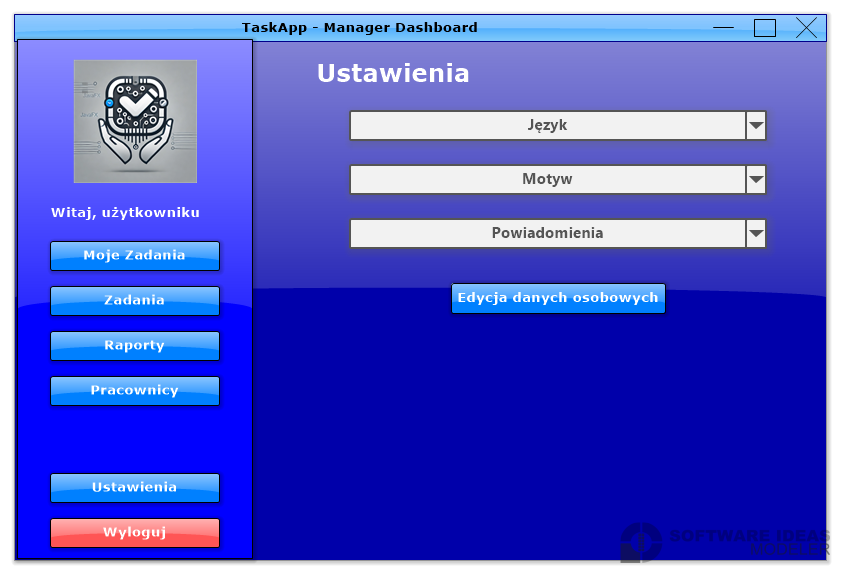
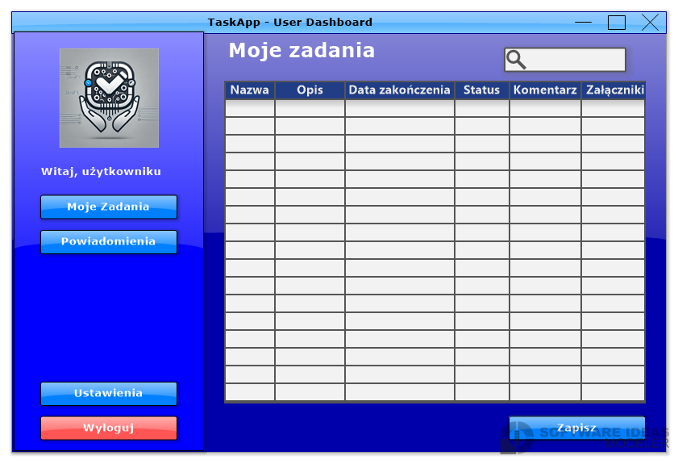

# TaskApp-JavaFX

> 🚀 **Comprehensive Task Management System for IT Companies** - Build enterprise-grade project management applications with JavaFX, role-based access control, and advanced reporting

## 📋 Description

Welcome to the **TaskApp-JavaFX** repository! This comprehensive task management system is designed specifically for IT companies, providing robust project management, task tracking, and reporting capabilities. Built with JavaFX and featuring a layered architecture, the system supports three distinct user roles (Administrator, Manager, User) with tailored interfaces and permissions for each role.

Developed as part of the Team Programming course, this project demonstrates best practices in desktop application development, database design, role-based access control, and team collaboration. The system features intuitive GUI design, comprehensive activity tracking, PDF report generation, and flexible team management capabilities.

## 📁 Repository Structure

```

TaskApp-JavaFX/
├── 🖥️ CODE/ # Application source code
│ ├── 📁 src/
│ │ ├── 📁 main/
│ │ │ ├── ☕ java/ # Java source files
│ │ │ │ ├── controllers/ # JavaFX controllers
│ │ │ │ ├── models/ # Data models
│ │ │ │ ├── services/ # Business logic
│ │ │ │ ├── utils/ # Utility classes
│ │ │ │ └── MainApplication.java
│ │ │ └── 📁 resources/
│ │ │ ├── fxml/ # FXML layout files
│ │ │ ├── css/ # Stylesheets
│ │ │ └── images/ # Application images
│ │ └── 📁 test/ # Unit tests
│ ├── 📦 pom.xml # Maven configuration
│ └── 📖 README.md # Code documentation
├── 🎨 GUI/IMG/ # GUI screenshots and mockups
│ ├── 🔐 Login.png # Login interface
│ ├── 📝 Registration.png # Registration screen
│ ├── 👨‍💼 DashboardAdmin.png # Administrator dashboard
│ ├── 👔 ManagerDashboard.png # Manager dashboard
│ ├── 👤 UserDashboard.png # User dashboard
│ ├── 📋 AddingTasks.png # Task creation
│ ├── ✏️ EditTask.png # Task editing
│ ├── 👥 AdminTeams.png # Team management
│ ├── 🏗️ AdminTeamCreation.png # Team creation
│ ├── ⚙️ AdminSettings.png # System settings
│ └── 📊 AdminReports.png # Reporting interface
├── 📋 UML/ # UML diagrams
│ ├── 📊 UseCaseDiagram.png # Use case diagram
│ ├── 🔄 ChartActivities1-7.png # Activity diagrams
│ └── 📈 SequenceDiagram3-6.png # Sequence diagrams
├── 🗄️ SQL/ # Database scripts and ERD
│ ├── 📊 erd1.png # Entity Relationship Diagram 1
│ ├── 📊 erd2.png # Entity Relationship Diagram 2
│ ├── 🔄 migration.sql # Database migrations
│ └── 🌱 seeder.sql # Database seed data
├── 📊 DAILY/ # Daily progress reports
├── 📚 DOC/ # Documentation and images
├── 🔧 INSTALL/ # Installation files
├── 📖 JAVA_DOCS/ # JavaDoc documentation
├── 📄 PDF/ # PDF documentation
├── 📊 SLIDES/ # Presentation slides
├── 📜 LICENSE # Project license
└── 📝 README.md # Project documentation

```

## 🚀 Getting Started

### 1. Clone the Repository

```bash
git clone https://github.com/dawidolko/TaskApp-JavaFX.git
cd TaskApp-JavaFX
```

### 2. Database Setup

```bash
# Navigate to SQL directory
cd SQL

# Create database and run migrations
mysql -u root -p < migration.sql

# Seed database with initial data
mysql -u root -p < seeder.sql
```

### 3. Build the Application

```bash
# Navigate to CODE directory
cd CODE

# Build with Maven
mvn clean install
```

### 4. Run the Application

#### Using Maven:

```bash
mvn javafx:run
```

#### Using IDE:

Run `MainApplication` class in your Java IDE (IntelliJ IDEA, Eclipse, NetBeans)

## ⚙️ System Requirements

### **Essential Tools:**

- **Java Development Kit (JDK)** 11 or higher
- **JavaFX SDK** 11 or higher
- **Maven** 3.6 or higher
- **MySQL** 5.7 or higher
- **Git** for version control

### **Development Environment:**

- **IDE** (IntelliJ IDEA, Eclipse, NetBeans)
- **Scene Builder** for FXML editing (optional)
- **MySQL Workbench** or similar database tool
- **Maven** build automation

### **Recommended Tools:**

- **JavaFX Scene Builder** for visual FXML editing
- **MySQL Workbench** for database management
- **Git GUI Client** (GitKraken, SourceTree)
- **UML Diagramming Tool** (StarUML, Visual Paradigm)

### **JavaFX Dependencies:**

- **JavaFX Controls** for UI components
- **JavaFX FXML** for layout management
- **JavaFX Graphics** for animations
- **JavaFX Web** for embedded browser (optional)

## ✨ Key Features

### **🔐 User & Role Management**

- Three distinct user roles: Administrator, Manager, User
- Role-based access control (RBAC) system
- Create, edit, and delete user accounts
- Secure authentication and authorization
- User profile management and preferences
- Activity logging and audit trails

### **📋 Task Management**

- Create, assign, and track tasks
- Task priority levels and status tracking
- Due date management and reminders
- Task progress monitoring
- Task categorization and tagging
- Bulk task operations
- Task dependencies and relationships

### **👥 Team Management**

- Create and manage development teams
- Assign team members and leaders
- Team performance analytics
- Team workload distribution
- Cross-team collaboration support
- Team hierarchy and organization

### **📊 Advanced Reporting**

- Generate detailed PDF reports
- Customizable report filters (status, priority, assignee, date range)
- Task completion statistics
- Team performance metrics
- Project progress reports
- Export data in multiple formats

### **⚙️ System Configuration**

- Customize system settings and preferences
- Define custom task statuses
- Configure priority levels
- Set up notification rules
- Manage system roles and permissions
- Theme and appearance customization

### **🗄️ Database Integration**

- Robust MySQL database backend
- Data persistence for all entities
- Transaction management
- Database migration support
- Automated backup capabilities
- Query optimization

### **📈 Activity Tracking**

- Monitor user activities and actions
- System logs with detailed timestamps
- User session management
- Error logging and debugging
- Performance monitoring
- Security audit trails

### **🎨 Modern User Interface**

- Intuitive JavaFX-based GUI
- Smooth animations and transitions
- Responsive layout design
- Custom themes and styling
- Accessibility features
- Multi-window support

## 🏗️ Architecture

The project follows a **layered architecture** pattern:

### **Frontend Layer (JavaFX)**

- User interface components
- FXML layouts and controllers
- CSS styling and animations
- Input validation and user feedback

### **Business Logic Layer (Java)**

- Service classes for core functionality
- Business rules and validation
- Data processing and transformation
- Error handling and logging

### **Data Access Layer**

- Database connection management
- SQL queries and stored procedures
- ORM-like data mapping
- Transaction handling

### **Database Layer (MySQL)**

- Data persistence and storage
- Relational data model
- Indexes and constraints
- Backup and recovery

## 🛠️ Technologies Used

- **Java 11+** - Core programming language
- **JavaFX** - Desktop UI framework
- **Maven** - Build automation and dependency management
- **FXML** - Declarative UI markup language
- **CSS** - Stylesheet language for JavaFX
- **MySQL** - Relational database management system
- **JDBC** - Java Database Connectivity
- **JUnit** - Unit testing framework
- **Log4j** - Logging framework

## 🖼️ Application Screenshots

### Authentication & Registration


_Secure login interface with authentication_


_User registration with validation_

### Administrator Views


_Complete system overview for administrators_


_Team management and monitoring_


_Intuitive team creation interface_


_Comprehensive team editing capabilities_


_Employee administration panel_


_Employee addition with role assignment_


_Employee profile editing_


_System-wide configuration settings_


_Activity logs and system monitoring_


_Comprehensive reporting interface_

### Manager Views


_Team and project management dashboard_


_Team member overview and management_


_Manager-specific configuration options_


_Detailed settings management_


_Team performance and task reports_

### User Views


_Personal task dashboard for users_


_Profile editing and personal information_


_User preference and notification settings_

### Task Management


_Task creation with detailed fields_


_Task modification and status updates_

## 📊 System Design Documentation

### Use Case Diagram


_Complete system use cases and user interactions_

### Activity Diagrams


_User authentication and authorization flow_


_Task creation and management processes_


_Employee management workflow_


_Report generation process_


_Team management activities_


_System configuration flow_


_Administrative operations and oversight_

### Sequence Diagrams


_System component interaction sequences_


_Database communication and data flow_


_User role-based interaction patterns_


_Task processing and update sequence_

## 🗄️ Database Design

### Entity Relationship Diagrams


_Main database structure and entity relationships_


_Detailed entity attributes and constraints_

## 👥 Development Team

### Team Roles and Responsibilities:

- **Dawid** - Frontend Development (JavaFX UI, animations, user experience)
- **Piotr** - Backend Development (business logic, service layer, database integration)
- **Łukasz** - Database Design and Implementation (schema design, migrations, optimization)
- **Piotr** - Database Support (query optimization, stored procedures, data integrity)

## 📚 Documentation

Comprehensive project documentation available in multiple formats:

- **📊 SLIDES/** - Project presentations and overviews
- **📄 PDF/** - Detailed technical documentation
- **📖 JAVA_DOCS/** - JavaDoc API documentation
- **📚 DOC/** - Additional guides and references
- **📊 DAILY/** - Daily progress reports and updates

## 📊 Project Status

🚧 **In Development** - Active development as part of Team Programming coursework

**Completed Features:**

- ✅ User authentication and role management
- ✅ Task creation and tracking
- ✅ Team management
- ✅ Reporting system
- ✅ Database integration
- ✅ UI/UX design for all user roles

**In Progress:**

- 🔄 Advanced analytics dashboard
- 🔄 Real-time notifications
- 🔄 Mobile companion app

## 🤝 Contributing

Contributions are highly welcomed! Here's how you can help:

- 🐛 **Report bugs** - Found an issue? Let us know!
- 💡 **Suggest improvements** - Have ideas for better features?
- 🔧 **Submit pull requests** - Share your enhancements and solutions
- 📖 **Improve documentation** - Help make the project clearer

Feel free to open issues or reach out through GitHub for any questions or suggestions.

## 👨‍💻 Authors

Created by the **TaskApp Development Team** - Part of the Team Programming course series.

## 📄 License

This project is open source and available under the [MIT License](LICENSE).

---
